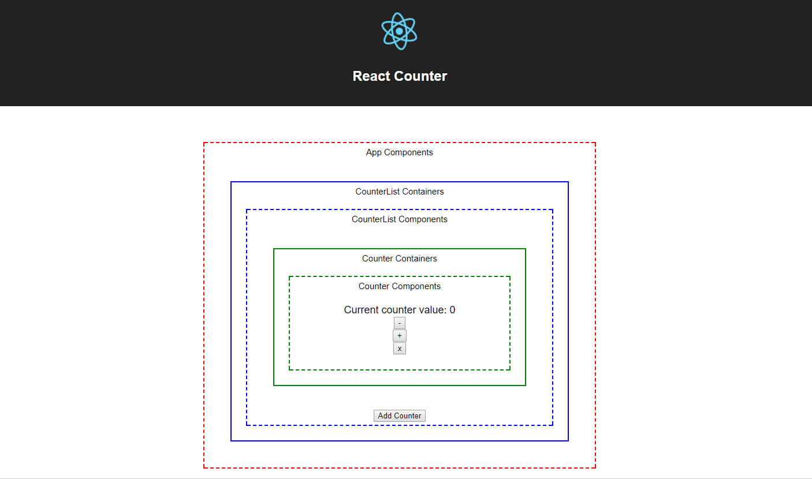

# React-Redux Counter Example

This is a React Redux counter app example. It implements redux design pattern which covers:
1. Actions
2. Containers
3. Components
4. Reducers

## Installation
Clone this repository and then do:

~~~bash
cd counter
npm install # install all necessary modules
~~~

Below are list of npm script that you can run:

~~~bash
npm start       # start the server at http://localhost:3000
npm test        # test everything
npm run build   # build the whole project
npm run eject   # remove the build tool and all configuration of create-react-app
~~~

## Project structure
The project structure will look like this:
~~~bash
| node_modules
| public                                        # Holds static assets and root file
| -- favicon.ico
| -- index.html
| -- manifest.json
| src                                           # All react components goes here 
| -- Modules                                    # All react components goes here
| -- -- Counter                                 # Counter Module
| -- -- -- Actions                              # All actions goes here
| -- -- -- -- Counter.js
| -- -- -- Components                           # All components goes here
| -- -- -- -- css
| -- -- -- -- img
| -- -- -- -- App.js
| -- -- -- -- App.test.js
| -- -- -- -- Counter.js
| -- -- -- -- Counter.test.js
| -- -- -- -- CounterList.js
| -- -- -- -- CounterList.test.js
| -- -- -- Constants                            # All constants goes here
| -- -- -- -- Counter.js
| -- -- -- Containers                           # All containers goes here
| -- -- -- -- Counter.js
| -- -- -- -- CounterList.js
| -- -- -- Reducers                             # All reducers goes here
| -- -- -- -- Counter.js
| -- index.css
| -- index.js                                   # Root react components
| -- registerServiceWorker.js                   # For PWA
| .gitignore
| package.json                                  # All npm packages used
| README.md
~~~

The folder is modularized by the responsibility of the corresponding feature. For example, here we want to implement the counter feature that has several characteristics described bellow:
1. Counter can increment and decrement number.
2. Number of Counters can be added or removed.
3. Each Counters available in the app holds its own data.

Thus all Counter related files will be assigned at folder named __Counter__.

To address the redux lifecyle, the Counter module will have this following folder:
1. Actions
2. Components
3. Constants
4. Containers
5. Reducers

Each folder contains files which represents the functions or constants of the corresponding module. 

For __Components__ folder, it serves as the __View__ of the module. Thus, static related assets will be grouped into css and img folder (and js folder if necessary).

Meanwhile, the components itself will stay inside the __Components__ folder and each components have two files, one serve as a main file, and one serve as a test file.

## Support
Any critiques or issues can be addressed at issues tab in this github.